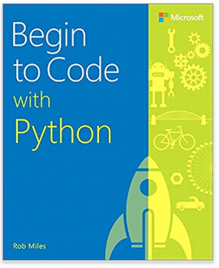

# Begin to Code with Python 



This is the sample code for the book "Begin to Code with Python" by Rob Miles. You can find the official Microsoft Press Store page for this book [here](https://www.microsoftpressstore.com/store/begin-to-code-with-python-9781509304523)
# Languages and tools
## Python
You should use the latest version of Python 3 which you can find [here](https://www.python.org/downloads/). There are versions of Python for many platforms. The book uses the Idle code editor which is included with the Python distribution. It doesn't matter which version of Python 3.n that you use, but you must *not* use any form of Python 2.n 
## Visual Studio Code
The book also uses Visual Studio Code which you can find [here](https://code.visualstudio.com/).
# Snaps
The Snaps framework is used for some of the graphical exercises in the text. You don't need it for most of the exercises. The Snaps framework uses PyGame for graphics and user input. You can find out how to install PyGame in the book. Take a look at page 65. The site for PyGame is [here](https://www.pygame.org).

## Important Notes:
### Typo
There is an error on page 66. Rather than it saying 

```
from snaps import * 
```

It should just say 

```
import snaps
```

To make snaps work you just have to have the snaps program in the same folder as your program. 
### Videos
There are some videos which take you through installing Python and Snaps. You can find them [here] (https://www.youtube.com/playlist?list=PL7zNOp_WVLyUZ5XoCP2w0Uhy02PnX5W9m).
### Using the keyboard with Snaps
There have been some reports of the keyboard reading function in Snaps not working correctly when you run your Python program from within an IDE such as pyCharm or IDLE. If you find the keyboard to be unresponsive, try running the Python program directly in Python, rather than inside an IDE. Check on page 63 for details of how to run a program from the desktop.
# Microsoft Certified Professional

You can find a set of notes that will help you use this book to revise for the Microsoft Certified Professional Exam  98-381, 'Introduction to Programming Using Python' [here](notes/prep.pdf)
# Buying the book
You can buy the book [here](http://a.co/abCAG81) 
# Getting in touch
You can find my blog at [www.robmiles.com](https://www.robmiles.com/) 
<p>If you have any questions about the links, the sample programs, or the book, you can get in touch with me via email on questions at begintocodewithpython.com. You can also tweet any questions to @begintocode or @robmiles
